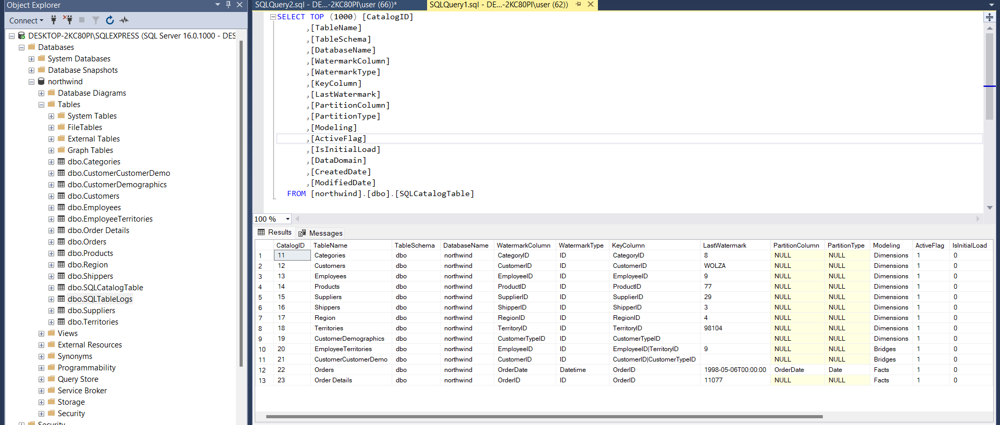
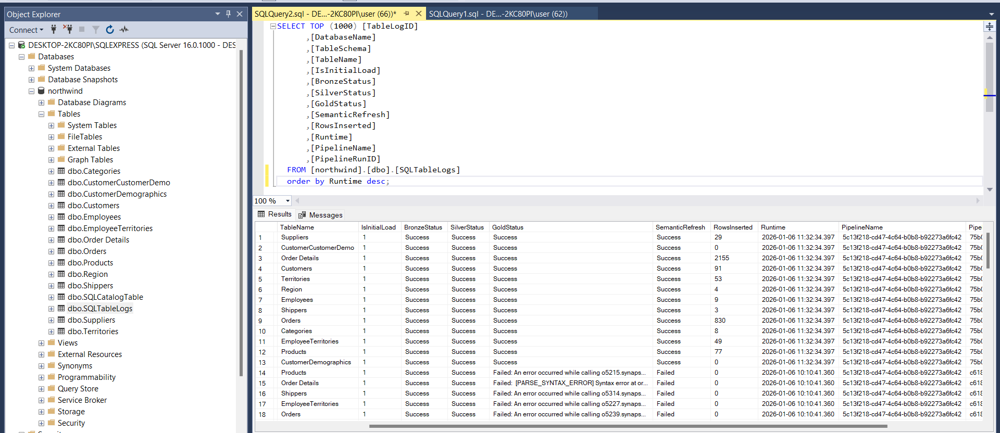
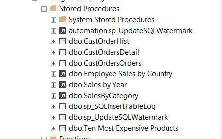
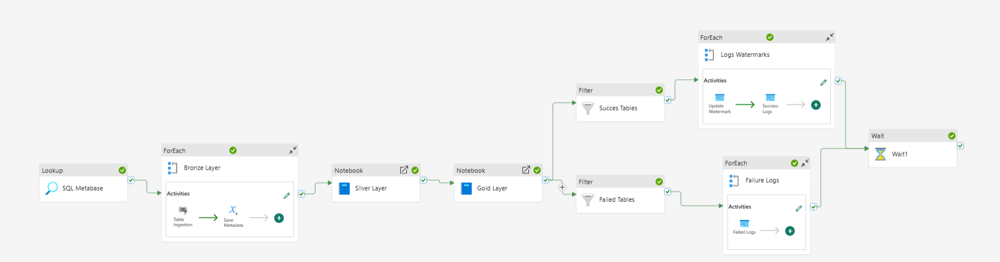
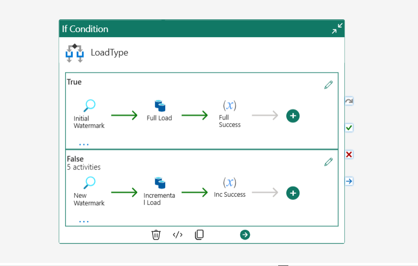
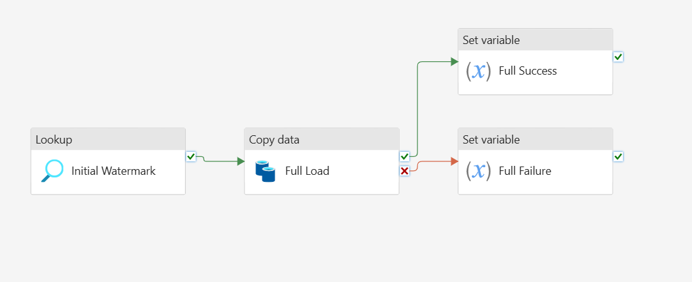

# Northwind_POC

This project is a **proof of concept** for building a **scalable, metadata-driven data platform** on Microsoft Fabric. It demonstrates how to automate the full ELT lifecycle, implement incremental ingestion, and manage a Lakehouse architecture .

---

## Requirements

To run and explore this project, you need the following components installed and configured:

- **On-premise Data Gateway** for secure connection to SQL Server.  
- **SQL Server** as the primary source database and metadata store.  
- **SQL Server Management Studio (SSMS)** for managing database objects and running queries.  
- **Microsoft Fabric**, including:  
  - **Notebooks** for Spark-based transformations  (Bronze + Silver Layers)
  - **Pipelines** for orchestration and workflow automation  (parent-child logic)
  - **Semantic Model** for business logic and reporting  
  - **Lakehouse** for structured storage (schema-on-read)  
  - **Warehouse** for aggregated reporting  

This project focuses on:

- Automating the **entire ELT lifecycle** within Fabric.  
- Demonstrating **reusability and flexibility** via metadata-driven configuration.  
- Enabling **incremental ingestion using watermarking** to efficiently process new data.  
- Implementing **structured transformations** from Silver to Gold layers.  
- Providing **logging and auditability** across all stages.  

It validates that Microsoft Fabric can support:

- **Metadata-driven data platforms** for simplified management.  
- **Dynamic orchestration** with SQL-based configuration.  
- Handling **real-world ingestion and transformation complexities**.  
- Full **observability**, including logs, watermarks, and audit tables.  
- **Best practices in Lakehouse architecture**, leveraging Delta format, partitioning, and layered storage.

---

## Technologies & Patterns Used

This project leverages Microsoft Fabric as the main platform, combining orchestration, Spark-based transformations, and structured storage. Key technologies include:

- **Fabric Pipelines** to orchestrate parent-child workflows and enable modular, reusable pipelines.  
- **Fabric Notebooks** for Spark-powered transformations and data processing logic.  
- **Delta Lake** as the storage format for the Lakehouse, enabling efficient partitioning and versioning.  
- **SQL Server** as the source database and metadata engine for configuration, watermarks, and audit tracking.  
- **T-SQL Procedures** to handle watermarking, auditing, and control flow logic.  

The project also implements several architectural patterns, including **metadata-driven configuration**, **incremental ingestion**, **layered Lakehouse structure (Bronze → Silver → Gold)**, and **enterprise-grade logging**.

---

## Project Main Artifacts and Roles

### Data & Metadata Structures

The solution is built on a metadata-driven approach, starting with a central **SQL Catalog table** that stores all configuration details related to the source database tables, including load type, watermarks, and control flags. This table drives the dynamic behavior of the pipelines.

A dedicated **Logs table** is used to capture detailed execution metadata for each pipeline run. It records pipeline identifiers, layer-level execution status, timestamps, and other operational metrics required for monitoring and audit purposes.

To support orchestration and observability, **stored procedures** are implemented and invoked directly from the pipelines. These procedures manage watermark updates and persist execution logs into the SQL Logs table.

### Pipeline & Orchestration

The **parent pipeline** orchestrates the overall ingestion workflow. It coordinates metadata retrieval, control logic, and the execution of child pipelines responsible for data ingestion and transformation.

The **child pipeline** performs the actual ingestion logic. Its behavior is dynamically driven by the `IsInitialLoad` flag defined in the SQL Catalog table, allowing the pipeline to switch seamlessly between full and incremental load strategies.

### Initialization Logic

This pipeline is executed when a **full load** is required, typically during the first ingestion or a complete data reload scenario.

This pipeline is triggered when performing an **incremental load**, using watermark values to ingest only new or updated data since the last successful execution.

### Next steps
- Integrate **error handling and retry mechanisms** at pipeline and activity levels.
- Implement **row-level change detection** using hash-based comparison for non-watermark tables.
- Introduce **CI/CD pipelines** for automated deployment across environments (Dev / Test / Prod).
- Expand the semantic model to support **business-ready KPIs and analytical use cases**.
